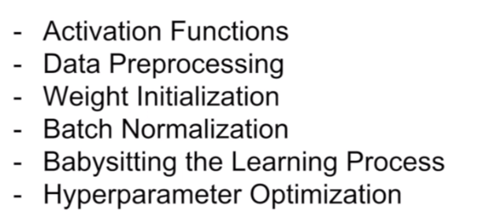
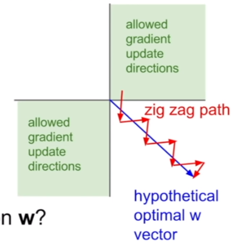

# 训练神经网络
1. 激活函数
2. 数据预处理
3. 权值初始化
4. 批量正则化
5. 训练过程监控
6. 超参数优化

## 激活函数
### 1. Sigmoid函数
* 饱和神经元会使梯度消失：当X足够小或者足够大时，其导数接近于0
* Sigmoid输出不是以0为中心的：函数关于权值W的导数为X，一般数据都为正数的情况下，权值会朝着一个方向更新，通过中心化数据可以解决这个问题

* exp()计算代价高
### 2. tanh函数
与sigmoid函数类似
### 3. ReLu函数（rectified linear unit）
没有饱和的情况、
计算更快、
存在Sigmoid函数的第二个问题

存在active relu 和 dead relu，如果参数初始化脱离了数据，那参数永远也不会更新. 也有可能初始化是正确的,但学习率过大导致参数更新过大成为dead relu.

